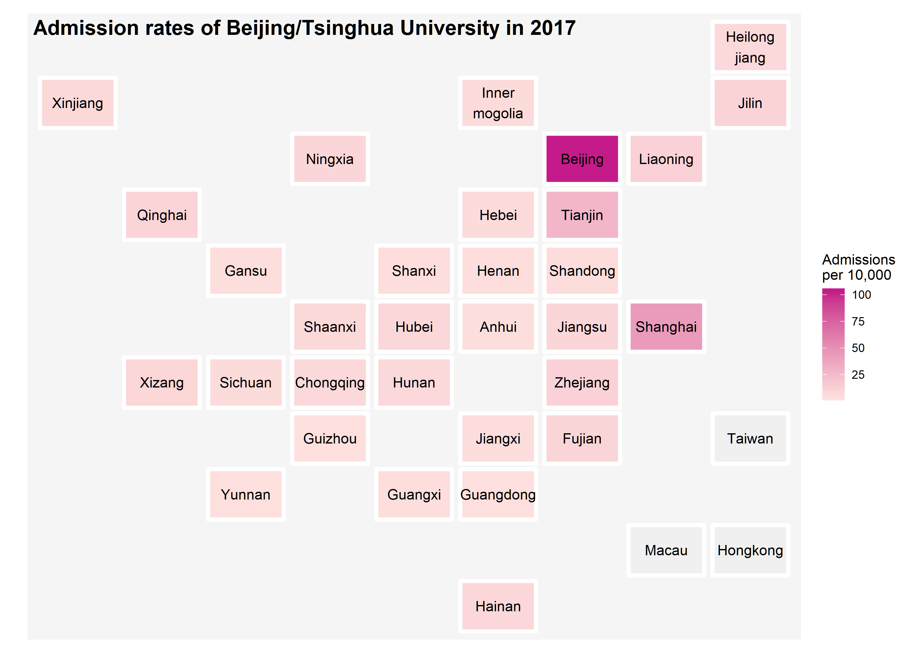
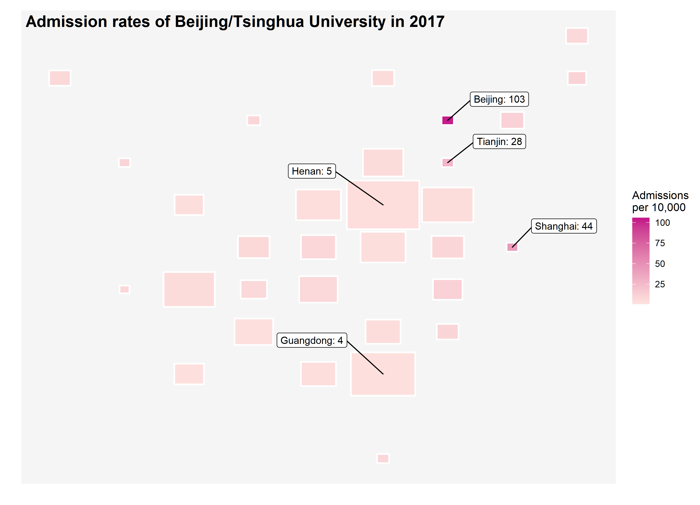
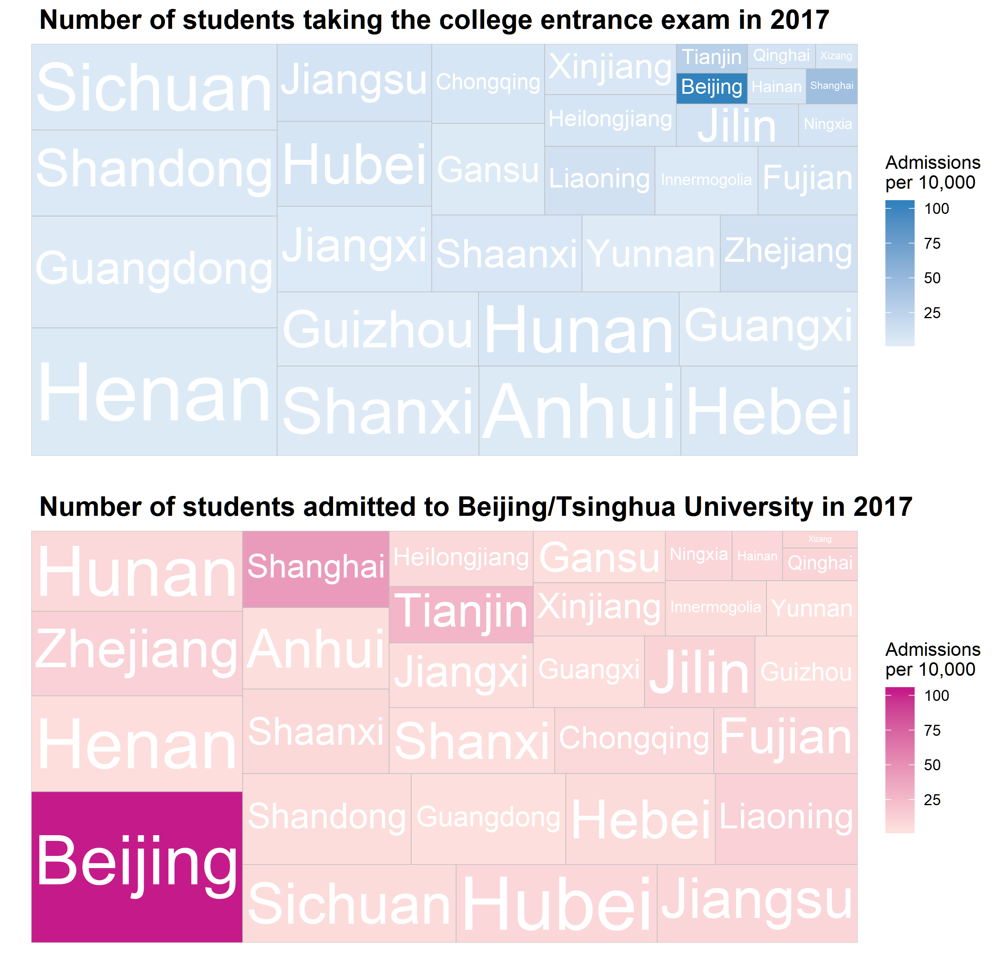

---
authors:
- admin
date: "2019-06-28"
draft: false
gallery_item:
image:
  caption: ''
  focal_point: "left"
  preview_only: false
lastmod: "2019-06-28T00:00:00-08:00"
summary: data visualization of the college entrace exam data in 2017
projects:
- viz
tags:
- R
- Statistical analysis 
- Data viz
title: 'How difficult it is to get into the top universities in China'
---


## Background

In June of 2019, over 10 millions students took the gaokao, the college entrace exam in China. This exam varies by province to province, so it is the admission rate to the top universities (Beijing/Tsinghua University). I often get asked how difficult to get into those two schools in China. I hope this data visualization will help you understand the admission rates of the top universities across different provinces in China by using the data in 2017. 


## Data visualization
The geo location of provinces in China was downloade from the R pacakge [`geofacet`](https://hafen.github.io/geofacet/) by Ryan Hafen. My first intention of starting this project was inspired by a talk introducing this package. As you can easily tell from the following plots, the style was gently borrowed from the `geofacet`. 

### High admission rates in Beijing, Tianjin, and Shanghai
As you probably notice from the plot below, there are three places with very different color patterns compared to the rest of the country. The gaokao is a province-based exam so that there might be some variations. But it is uncommon to see those highly favored results happened to occur in bigger cities. It is often critized that Beijing/Tsinghua University do admit more students from these three places. Then, you might ask whether there are more students living there because these are bigger cities. The admission rates range from 0.03% to 1.03% in 2017. 

```
ggplot(rates, aes(col, row, label = province)) +
  geom_tile(aes(fill = rate*100), colour = "white", 
            width=0.9, height=0.9, size=1.5, linejoin = "round") +
  geom_text() +
  scale_fill_gradient(low = "#fde0dd", high = "#c51b8a", na.value = "#f0f0f0", 
                       name = "Admissions\nper 10,000") +
  theme_gray() +
  labs(title = " Admission rates of Beijing/Tsinghua University in 2017",
       x = "", y = "")+
  theme(axis.text = element_blank(), 
        axis.ticks = element_blank(), 
        panel.grid.major = element_blank(), 
        panel.grid.minor = element_blank(),
        panel.background = element_rect(fill = "#f5f5f5"),
        plot.title = element_text(size=16, face="bold", 
                                  margin = margin(b = -20, t = 10)))

```


  

### Unproportional admission rates 
Then, I tried to add one more layer of information into the plot by making the size of the tile proportional to the number of students taking the gaokao. Guess what, you can barely find these three places no more because they all shrink to almost points. The number of students taking the gaokao is substantially lower in these three places compared to the other regions of China but with surprisingly high admission rates. Since, the size of these three plots become so small that I have to use `ggrepel` to label them individually. 

```
ggplot(rates, aes(col, row)) +
  geom_tile(aes(fill = rate*100, width = norm + 0.12, height = norm + 0.15), 
            colour = "white", 
            size=0.75, linejoin = "round") +
  geom_label_repel(data = subset(rates, rate > 0.2), nudge_y = 0.5, 
                   nudge_x = 0.8, 
                   aes(label = paste0(province,": ", round(rate, 2)*100)), 
                   size = 3.5, force = 10) +
  geom_label_repel(data = subset(rates, pop > 60), nudge_y = 0.8, 
                   nudge_x = -1.1, 
                   aes(label = paste0(province,": ", round(rate, 2)*100)), 
                   size = 3.5, force = 10) +
  scale_fill_gradient(low = "#fde0dd", high = "#c51b8a", na.value = "#f0f0f0", 
                      name = "Admissions\nper 10,000") +
  labs(title = " Admission rates of Beijing/Tsinghua University in 2017",
       x = "", y = "")+
  theme(axis.text = element_blank(), 
        axis.ticks = element_blank(), 
        panel.grid.major = element_blank(), 
        panel.grid.minor = element_blank(),
        panel.background = element_rect(fill = "#f5f5f5"),
        plot.title = element_text(size=16, face="bold", 
                                  margin = margin(b = -20, t = 10)))
```


  

The same conclusion can be derived from the following two treemap plots using `treemapify`. I was planning to use the traditional scatter plots with different size of points but later became interested in trying this new way of showing the imbalanced proportions within groups. For example, Beijing is one of provinces in which fewest students took the exam but has the most students admitted to the top universities in China. 

```
p1<- ggplot(rates, aes(area = pop, fill = rate*100, label = province)) +
      geom_treemap() +
      geom_treemap_text(colour = "white", place = "centre",
                        grow = TRUE) +
      scale_fill_gradient(low = "#deebf7", high = "#3182bd", na.value = "#f0f0f0", 
                          name = "Admissions\nper 10,000") +
      labs(title = " Number of students taking the college entrance exam in 2017",
           x = "", y = "")+
      theme(axis.text = element_blank(), 
            axis.ticks = element_blank(), 
            panel.grid.major = element_blank(), 
            panel.grid.minor = element_blank(),
            panel.background = element_rect(fill = "#f5f5f5"),
            plot.title = element_text(size=16, face="bold"))

p2 <- ggplot(rates, aes(area = total, fill = rate*100, label = province)) +
  geom_treemap() +
  geom_treemap_text(colour = "White", place = "centre",
                    grow = TRUE) +
  scale_fill_gradient(low = "#fde0dd", high = "#c51b8a", na.value = "#f0f0f0", 
                      name = "Admissions\nper 10,000") +
  labs(title = " Number of students admitted to Beijing/Tsinghua University 
                in 2017",
       x = "", y = "")+
  theme(axis.text = element_blank(), 
        axis.ticks = element_blank(), 
        panel.grid.major = element_blank(), 
        panel.grid.minor = element_blank(),
        panel.background = element_rect(fill = "#f5f5f5"),
        plot.title = element_text(size=16, face="bold"))

cowplot::plot_grid(p1, p2, ncol = 1)

```
  

  